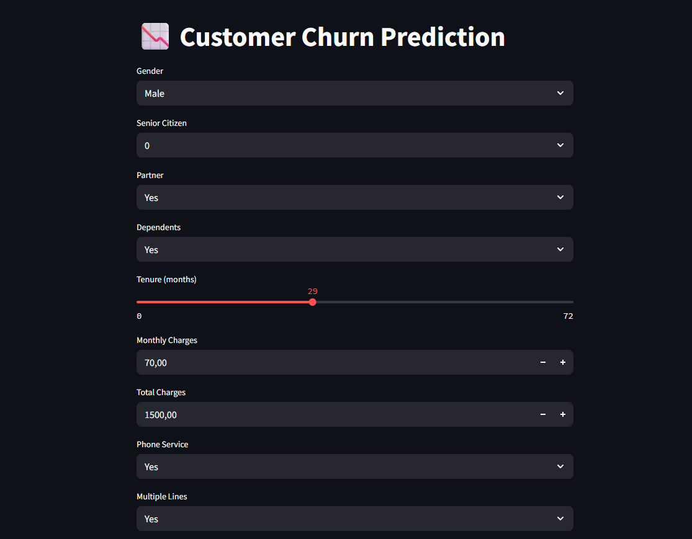
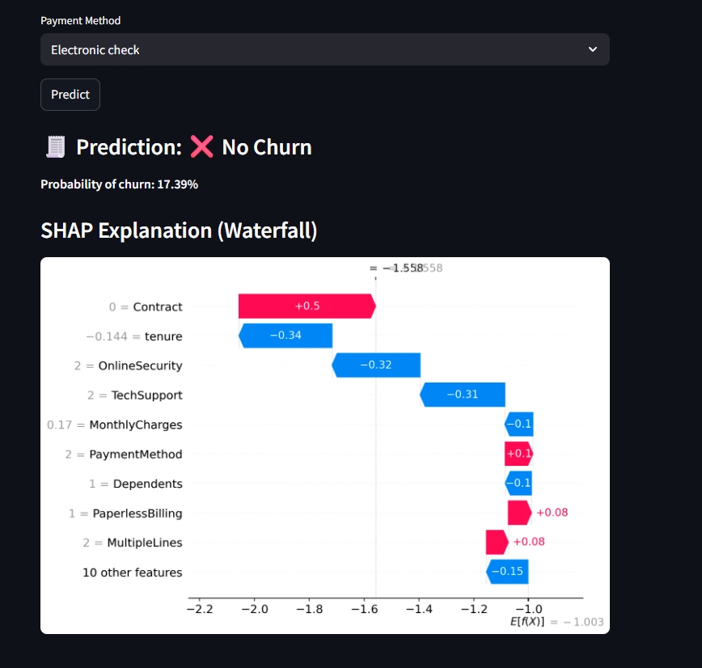

# 📉 Telecom Customer Churn Prediction

Predict customer churn using machine learning. This app uses a trained model and allows interactive prediction via a clean Streamlit interface.

---

## 🇵🇱 Opis projektu

Aplikacja przewiduje, czy klient operatora telekomunikacyjnego zrezygnuje z usług (*churn*), na podstawie jego danych demograficznych i historii płatności.

### 🧠 Technologie

* **scikit-learn**, **XGBoost** – modele uczenia maszynowego
* **Streamlit** – interfejs użytkownika
* **SHAP** – wyjaśnialność predykcji
* **joblib** – serializacja modelu i transformacji

### 🔍 Funkcje

* Interaktywny formularz do predykcji odejścia klienta
* Prawdopodobieństwo odejścia
* Wizualizacja wpływu cech (SHAP Waterfall)

### 📁 Struktura folderu

```
📆 Telecom-Churn
├── app.py                          # Główna aplikacja Streamlit
├── Telecom_Customer_Churn_Pred.ipynb  # Notebook treningowy
├── Telcom-Customer-Churn.csv      # Dane wejściowe
├── xgb.pkl                        # Wytrenowany model XGBoost
├── scaler.pkl                     # Standaryzacja zmiennych
├── le.pkl                         # Słownik LabelEncoderów
├── 1.png / 2.png                  # Zrzuty ekranu aplikacji
├── LICENSE
└── README.md
```

### 🚀 Uruchomienie lokalne

1. Zainstaluj wymagane biblioteki:

```bash
pip install -r requirements.txt
```

2. Uruchom aplikację:

```bash
streamlit run app.py
```

3. Wejdź w przeglądarce na: [http://localhost:8501](http://localhost:8501)

### 🔦 Przykładowe zrzuty ekranu




---

## 🇬🇧 Project Description

This app predicts customer churn for a telecom company using pre-trained machine learning models.

### 🧠 Technologies

* **scikit-learn**, **XGBoost** — machine learning models
* **Streamlit** — interactive UI
* **SHAP** — interpretability of predictions
* **joblib** — model and preprocessing persistence

### 🔍 Features

* Interactive form for churn prediction
* Displays churn probability
* Feature contribution explained with SHAP

### 📁 Folder Structure

```
📆 Telecom-Churn
├── app.py                          # Streamlit app
├── Telecom_Customer_Churn_Pred.ipynb  # Model training notebook
├── Telcom-Customer-Churn.csv      # Dataset
├── xgb.pkl                        # Trained XGBoost model
├── scaler.pkl                     # StandardScaler object
├── le.pkl                         # Dictionary of LabelEncoders
├── 1.png / 2.png                  # UI screenshots
├── LICENSE
└── README.md
```

### 🚀 How to Run Locally

1. Install required packages:

```bash
pip install -r requirements.txt
```

2. Launch the app:

```bash
streamlit run app.py
```

3. Open in browser: [http://localhost:8501](http://localhost:8501)

### 📸 Sample Screenshots


---

## ✉️ License

MIT License. See [LICENSE](LICENSE) for more information.
